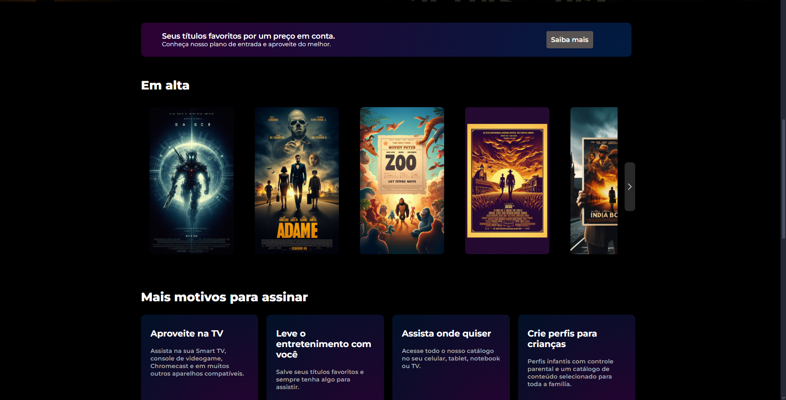

# Réplica da Interface de Streaming

## 📖 Sobre o Projeto

Este projeto é uma réplica genérica de uma página de streaming, desenvolvido como parte dos meus estudos em desenvolvimento front-end. O objetivo foi recriar os principais componentes visuais e interativos da página, focando em HTML semântico, CSS moderno e manipulação do DOM com JavaScript puro.

---

## ✨ Funcionalidades Implementadas

* **Carrossel de Títulos Interativo:** Um carrossel funcional construído com JavaScript puro, que permite a navegação pelos títulos, com botões que aparecem e desaparecem de forma inteligente.
* **Recálculo Dinâmico:** O carrossel se recalcula e se ajusta automaticamente quando a janela do navegador é redimensionada, garantindo uma experiência consistente em qualquer dispositivo.
* **Design Totalmente Responsivo:** A interface se adapta para uma visualização otimizada em desktops, tablets e celulares, utilizando Media Queries.
* **Seção de FAQ estilo "Acordeão":** Implementado de forma nativa e acessível com as tags `
` e `
` do HTML5.
* **Estilização Moderna:** Uso de técnicas avançadas de CSS3 como Flexbox, Grid Layout, gradientes e transições para criar uma interface visualmente agradável.

---

## 🛠️ Tecnologias Utilizadas

O projeto foi construído utilizando as seguintes tecnologias:

-   **HTML5:** Estruturação semântica do conteúdo.
-   **CSS3:** Estilização, animações e layout (utilizando Flexbox e/ou Grid).
-   **JavaScript (Puro):** Manipulação do DOM para criar as interatividades do carrossel e do acordeão.

---

## 🔗 Acesso ao Projeto

Você pode visualizar o resultado final do projeto através do link abaixo:

[**Clique aqui para ver o site no ar!**](https://edson66.github.io/projeto-codeplay/) ---

## 👨‍💻 Autor

Feito por Edson Ulisses.

-   **LinkedIn:** [Edson-Sobrinho](https://www.linkedin.com/in/edson-sobrinho-103657372)
-   **GitHub:** [@edson66](https://github.com/edson66)

